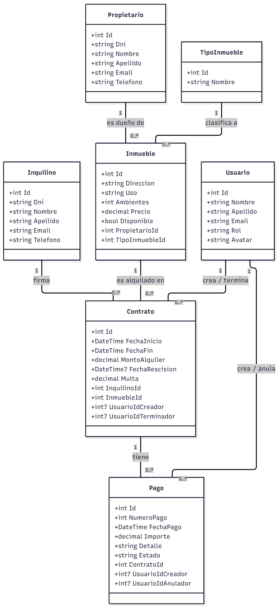

# InmobiliariaWebApp

Proyecto final para la materia Laboratorio de Programación (TUDS, ULP). Es un sistema web para la gestión de una inmobiliaria, construido con ASP.NET Core y ADO.NET, respetando la arquitectura Modelo-Vista-Controlador (MVC) y el patrón Repositorio.

## Objetivo del Proyecto

El objetivo principal es aplicar los conceptos de programación en C# y desarrollo web con ASP.NET Core para crear una aplicación robusta, demostrando una clara separación de responsabilidades (lógica de negocio en repositorios, control de flujo en controladores y presentación en vistas).

## Tecnologías Utilizadas

- **Backend:** ASP.NET Core MVC (.NET 8)
- **Lenguaje:** C#
- **Acceso a Datos:** ADO.NET con el proveedor `MySqlConnector` (versión optimizada y moderna).
- **Base de Datos:** MySQL / MariaDB.
- **Frontend:** HTML, CSS, Bootstrap, Razor Pages.

## Funcionalidades Implementadas

- **Gestión de Entidades (ABM/CRUD):**
  - Propietarios
  - Inquilinos
  - Inmuebles (con relación a Propietarios y Tipos)
  - Tipos de Inmueble
  - Contratos (con relación a Inquilinos e Inmuebles)
  - Pagos (asociados a Contratos)
- **Sistema de Usuarios y Seguridad:**
  - Registro y Login de usuarios con sistema de cookies.
  - Roles de **Administrador** y **Empleado**.
  - Edición de perfil de usuario (datos personales, cambio de contraseña y gestión de avatar).
  - Autorización por roles (e.g., solo administradores pueden eliminar registros o gestionar usuarios).
- **Lógica de Negocio Avanzada:**
  - Validación para evitar superposición de fechas en contratos.
  - Función para terminar contratos anticipadamente con cálculo y registro de multa.
  - Función para renovar contratos existentes.
- **Búsquedas y Reportes:**
  - Buscador de inmuebles disponibles por rango de fechas y otros criterios.
  - Reporte de contratos vigentes.
  - Reporte de contratos próximos a vencer.
  - Reporte de inmuebles por propietario.
  - Reporte de contratos por inmueble.
- **Auditoría y Usabilidad:**
  - Registro de qué usuario realiza las acciones clave.
  - Visualización de auditoría solo para administradores.
  - Notificaciones de éxito/error para mejorar la experiencia de usuario.

## Diagrama de Clases



## Guía de Instalación y Ejecución (A prueba de errores)

1.  **Prerrequisitos:**
    - Tener instalado el **SDK de .NET 8** (o superior).
    - Tener **XAMPP** instalado y los módulos de **Apache** y **MySQL** en ejecución.
    - Git.

2.  **Clonar el Repositorio:**
    ```sh
    git clone https://github.com/sanchoponcho08/InmobiliariaWebApp.git
    cd InmobiliariaWebApp
    ```

3.  **Preparar la Base de Datos:**
    - Abre **phpMyAdmin** desde el panel de control de XAMPP.
    - Crea una nueva base de datos llamada `inmobiliaria_db`.
    - Selecciona la base de datos recién creada y ve a la pestaña **Importar**.
    - Haz clic en "Seleccionar archivo" e importa el archivo `inmobiliaria_db.sql` que se encuentra en la raíz del proyecto.

4.  **Configurar la Conexión:**
    - El proyecto ya está pre-configurado para funcionar con una instalación estándar de XAMPP.
    - Verifica que el archivo `appsettings.json` contenga la siguiente cadena de conexión (ya debería estar así):
    ```json
    "ConnectionStrings": {
      "DefaultConnection": "server=127.0.0.1;port=3306;database=inmobiliaria_db;user=root;password=;SslMode=None;"
    }
    ```

5.  **Ejecutar la Aplicación:**
    - Abre una terminal en la raíz del proyecto y ejecuta el siguiente comando:
    ```sh
    dotnet watch
    ```
    - La aplicación se iniciará y estará disponible en la URL que indique la consola (ej. `http://localhost:5237`).

## Credenciales de Prueba

Para evaluar el proyecto, se pueden utilizar los siguientes usuarios:

- **Rol Administrador:**
  - **Email:** `admin@inmobiliaria.com`
  - **Contraseña:** `admin123`

- **Rol Empleado:**
  - **Email:** `empleadodelmes@inmobiliaria.com`
  - **Contraseña:** `contraseña`
